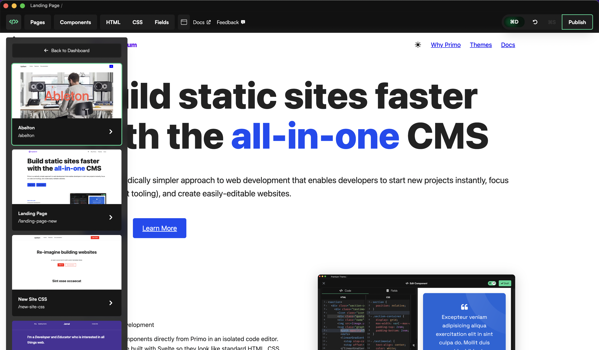

# Primo Server

This project lets you run Primo on your own server so you have full control over your own data and can edit your sites from any device, as well as invite others to collaborate. 

At this stage, we're relying heavily on external services (Vercel for hosting, Supabase for backend) to make deployment as easily as possible. But it would also be relatively easy to replace those services with your own infastructure, should you prefer that. 

If you're just building websites for yourself, you may prefer just using Primo Desktop. This project allows you to run Primo on a server so that you can access and edit your sites from any device and invite other developers and content editors to collaborate on them with you. 

## Project Status

Primo Server is in Alpha while we iron out the kinks and figure out the best way to set things up. You should expect a lot of breaking changes while we're still in Alpha, but still find it useable enough for side projects. 

## How it works

Primo Server deploys to Vercel and uses Supabase for authentication, database (PostgresSQL), and storage. 

If you have any ideas or time to contribute, feel free to open an issue or come talk to us in the [primo Discord](https://discord.gg/vzSFTS9). 

## Setup 
Before deploying your Primo Server, you'll need to sign up for [Supabase](https://supabase.co) and create a new project. 

1. Click the above Vercel 'Deploy' button
1. For 'Configure Project', enter your Supabase project URL and Public Key (from settings > API)
1. Click 'Deploy'